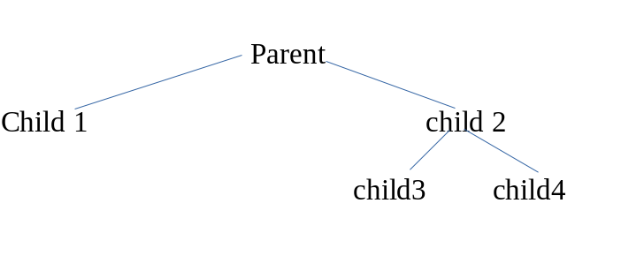

### Problem61:
Write a C program which will create child processes in the following tree format. Make sure that the output of print statement generated by various child and parent processes strictly followed any one of the following  sequence.  

<!-- image insert -->

#### Output:

Child 3 My id is ___ and my parent id is _____.  
Child 4 My id is ___ and my parent id is _____.  
Child 2 My id is ___ and my parent id is _____.  
Child 1 My id is ___ and my parent id is _____.  
Parent Process my id is ___ and my parent id is _____.

or

Child 4 My id is ___ and my parent id is _____.  
Child 3 My id is ___ and my parent id is _____.  
Child 2 My id is ___ and my parent id is _____.  
Child 1 My id is ___ and my parent id is _____.  
Parent Process my id is ___ and my parent id is _____.

or

Child 1 My id is ___ and my parent id is _____.  
Child 3 My id is ___ and my parent id is _____.  
Child 4 My id is ___ and my parent id is _____.  
Child 2 My id is ___ and my parent id is _____.  
Parent Process my id is ___ and my parent id is _____.

or

Child 1 My id is ___ and my parent id is _____.  
Child 4 My id is ___ and my parent id is _____.  
Child 3 My id is ___ and my parent id is _____.  
Child 2 My id is ___ and my parent id is _____.  
Parent Process my id is ___ and my parent id is ____

### sender.c, receiver.c (Shared Memory):
Write two different programs (Sender and Receiver) in C to demonstrate IPC using shared memory.   
Process "Sender.c" will write atleast 100 bytes of data to the shared memory and process "Receiver.c"
will read from the shared memory and displays it. Then, "Receiver.c" will write atleast 100 bytes of data 
to the same shared memory and  "Sender.c" will read and displays it. 